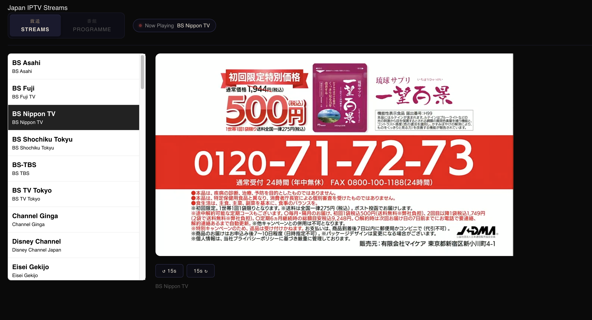
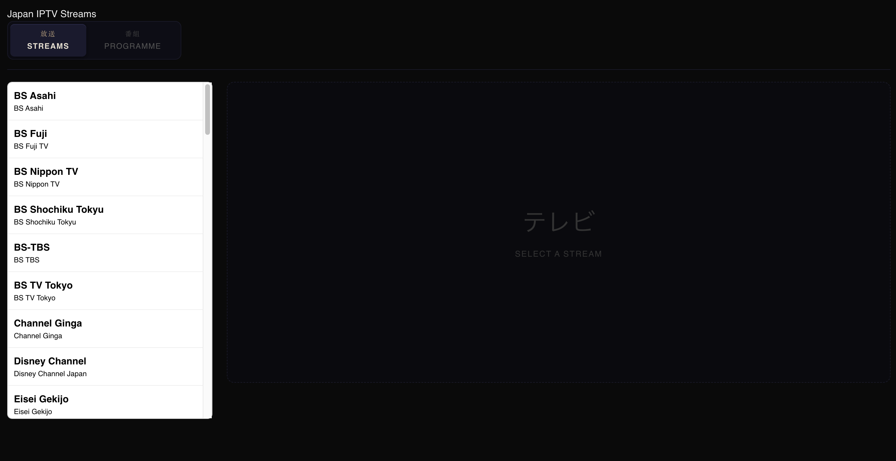
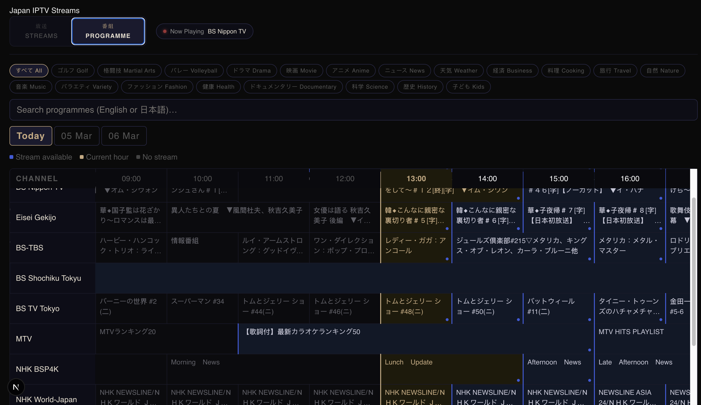

# Televi — Japanese IPTV Player with EPG


[](https://codercarl.dev)

> **テレビ** (Televi) — 日本のIPTVストリームと番組表を組み合わせた軽量ビューアです。
>
> A lightweight viewer combining Japanese IPTV streams with an electronic programme guide.

Televi is a lightweight IPTV viewer focused on **Japanese television streams**. It combines publicly available IPTV stream metadata with an automatically generated **Electronic Programme Guide (EPG)** so you can browse schedules and jump directly to live broadcasts.

Built with **Next.js**, with a **Docker-based EPG generator** for programme schedules.

---
## Screenshots　スクリーンショット





## Quick Start　はじめに

Install Docker Desktop, then:

```bash
git clone https://github.com/YOUR_USERNAME/televi.git
cd televi
npm install
npm run dev
```

The dev script will automatically:

1. Generate `docker/channels.xml` from stream data
2. Start the Docker EPG container
3. Warm streams and EPG caches
4. Launch the Next.js development server

---

## ⚠️ Docker Is Required　Dockerが必要です

Programme guide data is not available as a simple public API. We use the official IPTV-ORG EPG generator container to scrape TV listings and produce a standard XMLTV guide file.

Without Docker running, the **programme tab will not work**. The streams tab will still function normally — a warning will be printed in the console at startup if Docker is not detected.

Install Docker Desktop: https://www.docker.com/products/docker-desktop

Verify installation:

```bash
docker --version
docker ps
```

---

## System Architecture　システム構成

```
IPTV-ORG APIs
  (channels + streams + guides)
          │
          ▼
  generateChannelsXml.ts
  (builds docker/channels.xml from stream data)
          │
          ▼
  Docker EPG Generator
  (scrapes programme listings → programmes.xml)
          │
          ▼
  Data Controller
  (merges streams + EPG, manages caching)
          │
          ▼
      Next.js UI
    (streams tab + programme guide)
```

Streams are the **source of truth** — programme listings are filtered so only channels with a playable stream appear in the guide.

---

## Startup Sequence　起動順序

```
generate:channels
  (fetch streams, write channels.xml)
        │
        ▼
docker:start
  (start EPG container, wait 3s)
        │
        ▼
warm
  (fetch + cache streams and EPG)
        │
        ▼
next dev
```

---

## Scripts　スクリプト

| Command | Description |
|---|---|
| `npm run dev` | Full startup — channels, Docker, warm caches, dev server |
| `npm run warm` | Force refresh streams + EPG caches |
| `npm run generate:channels` | Regenerate `docker/channels.xml` from stream data |
| `npm run docker:start` | Start the EPG Docker container |
| `npm run docker:stop` | Stop the EPG Docker container |

---

## Project Structure　プロジェクト構成

```
app/
  data/
    data-controller.ts      # unified streams + EPG fetching and caching
    streams-cache.json      # auto-generated
    epg-cache.json          # auto-generated


  player/
    VideoPlayer.tsx
    StreamList.tsx
    useVideoJs.ts
    useStreamController.ts
    useFilteredStreams.ts
    programme/
      ProgrammeTab.tsx
      TooltipPortal.tsx

  types.ts
  page.tsx

lib/
  dates.ts
  log.ts

scripts/
  warmData.ts               # warms streams + EPG caches
  generateChannelsXml.ts    # generates docker/channels.xml

docker/
  programmes.xml            # OUTPUT: generated XMLTV guide
  docker-compose.yml

  public/
    channels.xml              # INPUT: channels to scrape (auto-generated)
```

---

## Data Sources　データソース

**Streams** — fetched from the IPTV-ORG public API:
```
https://iptv-org.github.io/api/streams.json
https://iptv-org.github.io/api/channels.json
https://iptv-org.github.io/api/guides.json
```

Only Japanese channels (`country === "JP"`) with HLS streams (`.m3u8`) are used.

**Programme Guide** — generated by the Docker EPG container reading `docker/channels.xml` and writing to `docker/programmes.xml` in standard XMLTV format.

---

## Caching　キャッシュ

Processed data is cached locally and refreshed daily:

```
app/data/streams-cache.json
app/data/epg-cache.json
```

Run `npm run warm` to manually refresh both caches.

---

## Known Limitations　既知の制限

- IPTV streams may go offline at any time
- Programme data depends on third-party scraping
- Docker must be running to generate programme listings
- Chromecast requires HTTPS — casting will not work on `http://localhost`


## Still todo

- ensure color contrast
- go through and audit components used
- ensure streamslist is tabbable into otherwise doesnt trap tab inside until the user goes through the streams list
- make video player castable
- ensure that video player controls are accessible
- filter categories properly

---

## License　ライセンス

MIT

## Author　作者

Created by **Carl Davidson**

Development notes and related articles can be found at:

https://codercarl.dev

If this project helps you build something interesting, feel free to link back to the site or reference the original project.

## Attribution　帰属
This project is built on data provided by the iptv-org project and its associated tooling:

iptv-org/iptv — community-maintained IPTV stream index
iptv-org/epg — EPG scraping utilities and Docker container
iptv-org/api — public API serving channels, streams, and guides

All stream data and programme listings are sourced from these projects. Televi does not host or distribute any content — it is a viewer interface only.